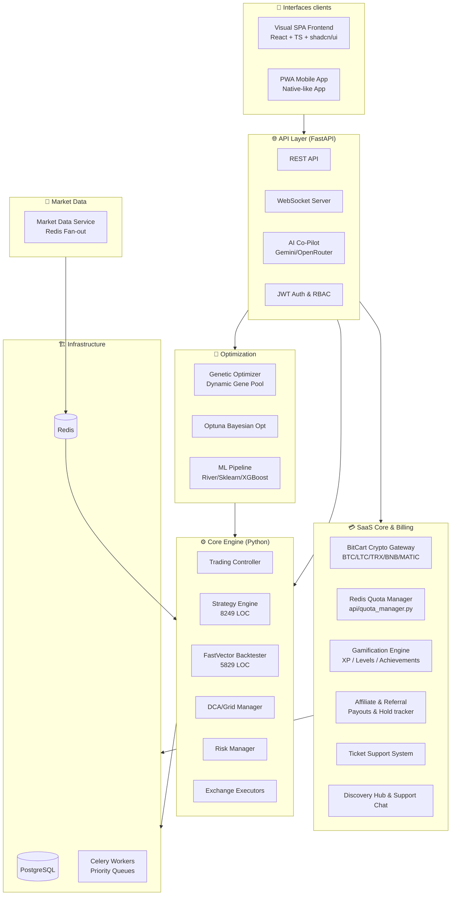

# DepthSight Architecture

DepthSight is a distributed system designed for multi-user, real-time algorithmic trading. It consists of several decoupled components interacting through Redis and PostgreSQL.

## High-Level Components

1. **FastAPI Backend (`api/`)**
   Serves as the administrative and configuration layer. It handles user authentication, strategy settings, and provides an REST API interface for starting/stopping trading bots, managing portfolios, and initiating long-running tasks.

2. **WebSocket Server (`api/websocket_server.py`)**
   A dedicated service for real-time data delivery. It acts as a bridge between Redis Pub/Sub channels (populated by the Bot) and frontend clients, providing instant updates on logs, active positions, and trading signals.

3. **Market Data Service (`market_data_service.py`)**
   A specialized service for centralized market data ingestion. It connects to exchanges via WebSockets, aggregates data, and fans it out to multiple trading bot instances via Redis (Pub/Sub and snapshots). This ensures that multiple user bots trading the same symbol share a single data stream, drastically reducing API load and latency.

4. **Trading Engine (`bot_runner.py` & `bot_module/`)**
   The core execution layer. It runs as one or more independent processes (sharded for scalability). In production mode, it operates in `Redis Mode`, receiving real-time market data from the `Market Data Service` instead of connecting to exchanges directly. Each user's account is managed by a `TradingController` which coordinates:
   - Data ingestion (`DataConsumer` via Redis)
   - Strategy logic
   - Risk management (`RiskManager`)
   - Order execution on exchanges (**Binance**, **Bybit**, **Bitget**, **OKX**, **Gate.io**, **BingX**).
        *Note: Binance execution is fully stable; other exchanges are recently integrated and are in active beta testing.*

5. **Background Workers (`tasks.py` / Celery)**
   A Celery-based worker pool that handles computationally expensive operations without blocking the API or the trading engine. Tasks include historical backtesting (using a custom vector engine), genetic strategy optimization, and post-trade analytics processing.

6. **Persistence & Messaging (Databases)**
   - **PostgreSQL**: Stores persistent, structured state such as User accounts, Strategy configurations, Trade history, and Backtest results.
   - **Redis**: The central nervous system and 'glue' of the architecture. It serves as:
     - **Message Broker** for Celery workers.
     - **Command Bus** for the API to control independent Bot processes (e.g., sending a `START_STRATEGY` command).
     - **Market Data Fan-out**: Central hub for real-time market data distribution from the `Market Data Service` to all active `Bots`.
     - **Real-time Event Bus** for streaming live logs and status updates via Pub/Sub.
     - **State Store** for transient runtime data and rate limiting.

7. **Frontends (`frontend/` & `pwa/`)**
   React-based applications (a web dashboard and a mobile-optimized PWA) that interact with the backend API via REST for configuration and receive live streaming updates via WebSockets.

8. **Discovery Hub (`api/hub_router.py` & `frontend/src/pages/CommunityHub.tsx`)**
   A community sharing and support hub. It features:
   - **Verified Presets**: Official strategy configurations that can be imported directly into the user's strategy editor.
   - **Trading Ideas**: Publicly shared user strategy results, complete with KPIs (win rate, PnL, drawdown, trades), mini equity curves, and comments.
   - **Interactive Network Map**: A live `<canvas>`-based visualization of the decentralized federation node topology, demonstrating real-time connection telemetry, pulsing halos, and a simulated node synchronization log feed (with complete IP address obfuscation to protect server privacy).
   - **Dialogue-Enabled Tickets**: Integrated ticket support chat directly connecting users with admins, supporting rich real-time text and screenshot attachments.

## Data and Control Flows

*   **Configuration Flow**: User (Frontend) -> REST API (`api/`) -> PostgreSQL.
*   **Control Flow**: User (Frontend) -> REST API -> Redis (Command Bus) -> Bot Runner (`bot_runner.py`) -> `TradingController`.
*   **Market Data Flow**: Exchange (WebSockets) -> `Market Data Service` -> Redis (Fan-out) -> `Bot` (DataConsumer).
*   **Execution Flow**: Processed Data -> `Controller` -> `Strategy` -> `RiskManager` -> `Executor` -> Exchange API.
*   **Observation Flow**: Bot (`Controller` / `RedisLogHandler`) -> Redis (Pub/Sub) -> WebSocket Server -> Frontend Dashboard.
*   **Analytics Flow**: Bot -> PostgreSQL (Trade records) -> Celery Task -> `TradeAnalytics` -> PostgreSQL.

## Key Source Files

*   `api/depthsight_api.py`: Main FastAPI entry point and REST routing.
*   `api/websocket_server.py`: Standalone WebSocket server.
*   `market_data_service.py`: Centralized market data ingestion service.
*   `bot_runner.py`: Process entry point for the trading bot, managing multi-user sharding.
*   `bot_module/controller.py`: Core of the trading engine, managing trade lifecycles.
*   `tasks.py`: Celery task definitions.
*   `api/models.py`: Database schema definitions.
*   `bot_module/redis_handler.py`: Redis Pub/Sub logging integration.
