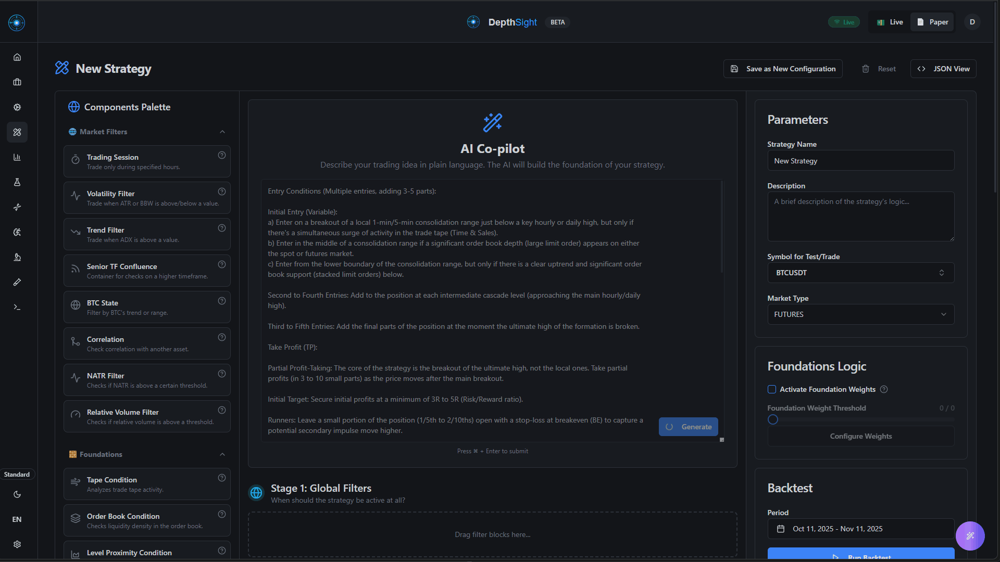

<p align="center">
  
</p>

<h1 align="center">DepthSight</h1>

<p align="center">
  <a href="LICENSE"></a>
  <a href="https://www.python.org/"></a>
  <a href="https://www.docker.com/"></a>
  <a href="#-one-click-deploy"></a>
  <a href="https://depthsight.pro"></a>
  <a href="https://depthsight.pro/docs/overview"></a>
  <a href="https://github.com/DepthSight-Pro/DepthSight/actions"></a>
</p>

<p align="center">
  <strong>The First Algorithmic Trading DePIN: Trade-to-Mine & Swarm AI 🐝</strong>
</p>

DepthSight is a first-of-its-kind **Web3 Trading DePIN** (Decentralized Physical Infrastructure Network) that completely flips the algorithmic trading industry on its head. Instead of paying expensive monthly subscriptions to platforms like 3Commas or Veles, **DepthSight pays you to trade.**

By utilizing our **Proof-of-Trade Mining** ($DEPTH), your daily trading volume generates utility tokens backed by actual fiat broker rebates, mathematically shifting your trading to a Positive Expected Value (Positive EV). 

**Beyond the tokenomics, DepthSight is an engineering powerhouse.** Under the hood, it is a fully open-source, Enterprise-Grade SaaS-in-a-Box featuring:
- 🧩 **Visual Strategy Builder:** A clean drag-and-drop block editor for building complex trading logic without coding (no messy spaghetti wires).
- 🤖 **AI Autopilot:** Multi-agent LLM system that generates strategies from text prompts and chart screenshots.
- ⚡ **High-Performance Core:** Python 3.11+ backend powered by FastAPI, Redis (Pub/Sub & State), Celery workers, and PostgreSQL.
- 🌐 **Federated Swarm:** The foundation for an upcoming collective intelligence network where nodes share profitable setups.

<p align="center">
  <em>Stop fighting the market alone. Join the Swarm. Get paid to trade.</em>
</p>

> ⭐ **If you find this project useful, please consider giving it a star! It helps the community grow and reach more developers.**

> **⚠️ DISCLAIMER: HIGH FINANCIAL RISK**
>
> **DepthSight is currently in Open Beta.** The software is provided "as is", without warranty of any kind. 
> Algorithmic and live trading involves real financial risk and can result in the total loss of your funds. The authors, contributors, and licensors of this project are **not responsible for any financial losses**, damages, or issues arising from the use of this software. 
> 
> Always use testnet or paper trading first. Do not connect real funds unless you fully understand the code and have verified the entire workflow in a controlled environment. You are solely responsible for your trading decisions and capital.

<p align="center">
  
  <br>
  <em>Describe your idea in plain language -> AI builds a complete multi-stage strategy.</em>
</p>

<div align="center">
  <details>
    <summary><b>🎬 Video Demonstration (Click to expand)</b></summary>
    <br>
    <a href="https://youtu.be/-Fxp-3VSODM" target="_blank">
      
    </a>
  </details>
</div>

## Core Features

- **Trade-to-Mine Economy (DePIN):** A built-in Positive-EV economic model where your daily trading volume generates $DEPTH utility tokens backed by broker rebates, subsidizing fees and rewarding active participants.
- **Visual Strategy Builder:** A drag-and-drop interface with 40+ logic blocks. Build complex strategies with cross-referencing nodes (e.g., dynamically place a stop loss behind order book density, a breakout candle, or a key level).
- **AI-Powered Assistant:** Generate complete strategy logic from text prompts or **even screenshots of chart setups**. The AI also analyzes your live trades and backtest results to provide actionable trading recommendations.
- **Weighted Foundations System:** Assign weights to different market conditions. A trade executes only if a target confidence threshold is met, allowing for flexible, probability-based entries rather than strict "all-or-nothing" boolean logic.
- **Dynamic Risk Management:** An intelligent RM engine that automatically adapts position sizing and risk parameters based on the historical and real-time performance of each specific trading pair.
- **Advanced Market Data:** Native support for order book snapshots, trade streams, open interest, BTC correlation, and multi-timeframe analysis.
- **Rich Visualization:** Complete transparency into bot logic. Every trade includes a detailed decision tree explaining *why* it was taken, visualized directly on trading charts.
- **Dual Backtesting Engines:** Lightning-fast vector backtester for rapid prototyping and genetic optimization, plus a detailed candle/tick-level engine for precise execution simulation.
- **Discovery Hub & Community Network:** A centralized sharing repository where users import verified strategy templates, inspect community trading ideas (complete with win rate, drawdown, mini-charts, and comments), and join discussions. Includes a live global node network topology map (with complete IP privacy) showing real-time heartbeat synchronization log feeds, and a dialogue-enabled support ticket system supporting chat messages and image uploads.
- **Enterprise-Grade Infrastructure:** FastAPI backend, real-time WebSocket events, background Celery workers, and multi-exchange execution.
## Enterprise-Grade Scalability

DepthSight is built for heavy-duty algorithmic trading, requiring a minimum of 4 modern CPU cores and 12GB RAM for a stable solo instance. Its stateless architecture naturally supports advanced horizontal scaling patterns for Cloud SaaS deployments handling thousands of users:

1. **Distributed Market Data (Sharding):** The centralized market data service reduces the number of exchange WebSocket connections, allowing for shard-based division of trading pairs.
2. **Redis Splitting:** Separate instances for system state (JWT, rate limits, Celery) and high-throughput HFT market data via Pub/Sub.
3. **Horizontal Worker Scaling:** Trading bot processes run in a sharded, stateless pool, evenly dividing computation and risk management processing across CPU cores or physical nodes.
4. **PgBouncer-Ready:** Designed to pool PostgreSQL connections, seamlessly handling thousands of concurrent connections from stateless FastAPI or bot worker nodes.

- **Supported Exchanges:** Native integration with **Binance**, **Bybit**, **OKX**, and **WEEX** (Fully tested and stable). Support for **Bitget**, **Gate.io**, and **BingX** is currently in development and will be enabled in future updates. 
  *Note: We recommend using Binance, Bybit, OKX, or WEEX for live trading at this stage.*
- **Multi-Tenant SaaS Ready:** Built-in JWT authentication, Redis-based quota management, and fully isolated execution environments designed for multi-user, commercial deployments.
- **Crypto Billing & Payments:** Native integration with Bitcart for processing cryptocurrency subscriptions and payments.
- **Modern Clients:** Full-featured React web dashboard and a mobile-optimized PWA.

## 🤖 AI Autopilot Co-Pilot

DepthSight includes an experimental, multi-agent AI system designed to help users generate and optimize trading strategies using natural language and computer vision.

1. **Multimodal Generation:** Upload a screenshot of a chart setup (e.g., a breakout or support/resistance bounce). The AI vision models detect the pattern and automatically generate a corresponding block-based strategy in the visual editor.
2. **Multi-Agent Optimization Loop:** A network of specialized agents (Researcher, Advisor, Critic) can run sequential backtests, analyze PnL metrics, and automatically mutate strategy parameters to find the optimal configuration.
3. **Human-in-the-Loop:** All AI-generated configurations are loaded into the visual editor. The AI cannot trade your funds autonomously—you review, adjust, and manually approve every strategy before it goes live.

## 💎 Trade Mining & Node Economy ($DEPTH)

DepthSight introduces the first Financial DePIN network with native **Proof-of-Trade Mining**, shifting the mathematical expected value (Positive EV) in favor of the algorithmic trader.

Instead of the exchange keeping 100% of your trading commissions, the DepthSight platform redirects exchange broker rebates into an aggressive, hyper-deflationary token economy:

- **Proof-of-Trade Mining:** You mine `$DEPTH` tokens simply by trading. Your daily hashrate is tied to the real USDT commissions your node generates. Even if your algorithmic bot trades near break-even, the massive cashback from mining can turn it into a highly profitable strategy.
- **Web3 Wallet Integration:** Users seamlessly link their existing non-custodial wallets (e.g., MetaMask, Phantom) to the platform. This decentralized identity allows traders to securely migrate their trading history, referrals, and reputation across any server in the DepthSight ecosystem without relying on traditional passwords.
- **Node Competition & Commissions:** Anyone can deploy a DepthSight node and become a "mini-exchange". Node admins define their own reward-sharing rates, competing globally for users and trading volume.
- **Hyper-Deflationary Flywheel:** 
  - **70/30 AI Burn:** 70% of all tokens spent on AI Swarm Intelligence queries are permanently burned.
  - **30% Fiat Buy-Back:** 30% of the platform's net fiat profit (USDT rebates) is used to continuously buy back and burn `$DEPTH` from the open market, establishing a mathematical price floor.


## 🚀 One-Click Deploy

DepthSight requires a minimum of 6 modern CPU cores and 16GB RAM. If you need a server, you can support this open-source project by using our referral links below:

- **[DigitalOcean](https://www.digitalocean.com/?refcode=681ba89f8858&utm_campaign=Referral_Invite&utm_medium=Referral_Program&utm_source=badge)** — Get **$200 in free credit** for 60 days. Excellent for stable API performance.
- **[Vultr](https://www.vultr.com/?ref=9905236-9J)** — Get **$300 in free credit** to test the platform. Great high-frequency compute nodes.
- **[LuxVPS](https://billing.luxvps.net/aff.php?aff=249)** — Best price-to-performance ratio (~€20/mo). Excellent choice for a budget-friendly but powerful trading node (Crypto accepted).
- **[is*hosting](https://ishosting.com/affiliate/NzU2OCM2)** — Premium hosting with a massive selection of global locations (from $50+/mo). Perfect if you need a server physically close to a specific exchange for lower latency (Crypto accepted).

Deploy a fully configured instance on any Ubuntu 22.04+ server with a single command. The script auto-installs Docker, generates all secrets, configures networking, sets up a firewall, and starts every service.

```bash
curl -sL "https://raw.githubusercontent.com/DepthSight-Pro/DepthSight/main/deploy.sh" | sudo bash
```

The interactive installer will ask for your domain (or default to `<IP>.sslip.io` with auto-SSL via Caddy), and optionally enable Bitcart crypto billing.

### Updating

You can update DepthSight in two ways:

#### 1. One-Click UI Update (Recommended)
DepthSight features a secure container-to-host auto-update mechanism:
* When you click **Update** in the admin web UI, the container writes a `.update_trigger` file into the shared `data/` volume.
* A host-side cron job (automatically set up by the installer) polls this directory, detects the trigger file, and executes the update script on the host.
* This allows seamless, zero-downtime updates directly from the web interface without exposing any host or root privileges to the Docker container itself.

#### 2. Manual Update via CLI
You can also trigger the update manually by running the host-side script:

```bash
sudo bash /opt/depthsight/update.sh
```

### Manual / Local Docker

```bash
cp .env.example .env
docker compose up -d --build
```

Before using this outside a local throwaway setup, replace all `change_me_*` secrets in `.env`, especially the Redis ACL passwords and API/JWT/encryption keys.

After startup:

- API docs: `http://localhost:8000/docs`
- Frontend: `http://localhost:5173`
- PWA: `http://localhost:5174`

## 💖 Support the Project

DepthSight is completely free and open-source. Maintaining a professional-grade trading infrastructure requires significant resources. To keep the project alive and free for everyone, we use exchange broker programs as our primary support mechanism.

**How it works:** By default, the software includes our Broker/Referral IDs for supported exchanges. When you trade using DepthSight, the exchange shares a small portion of their trading fee with us to fund further development. **This costs you absolutely nothing**—your trading fees remain exactly the same as they would be otherwise.

If you find this project valuable, please consider keeping the default Broker IDs active. 

Alternatively, if DepthSight has helped you automate your trading or build your business, you can support us directly via donations:
- **USDT (TRC-20):** `TJXbcdPuay8o1VKX2PGHzQ6kVtWjd7aDUi`
- **BTC:** `34GLMAKyzwuXZW9t6gUZhzF3x2gwBmh9uU`
- **ETH (ERC-20):** `0x83af3385655a3991d01fb9bf831bea4d75d99409`

*Thank you for your support!*

## License & Commercial Use

DepthSight is released under the **GNU AGPLv3** open-source license. You are free to download, modify, and run this platform for your personal trading. Furthermore, anyone who modifies and runs this software as a service over a network is required to release their modifications under the same AGPLv3 license.

**Dual Licensing for SaaS / Commercial Use:**
If you want to build a closed-source fin-tech business or a commercial SaaS offering on top of our infrastructure without open-sourcing your modifications under AGPLv3, you must purchase a commercial license. Please contact `admin@depthsight.pro` for White-Label licensing.

## Repository layout

```text
/
|-- api/            FastAPI app, auth, models, websocket server
|-- bot_module/     Trading engine, strategies, execution, backtesting
|-- frontend/       Web dashboard
|-- pwa/            Mobile PWA
|-- tests/          Automated test suite
|-- docs/           Public documentation

|-- docker-compose.yml
|-- requirements.txt
|-- market_data_service.py
`-- bot_runner.py
```

## Services and ports

| Service | Default port | Purpose |
| --- | ---: | --- |
| PostgreSQL | 5432 | Persistent storage |
| Redis | internal only | Cache, state, pub/sub, task broker |
| API | 8000 | REST API |
| WebSocket | 8765 | Real-time events |
| Frontend | 5173 | Web dashboard |
| PWA | 5174 | Mobile client |
| Bot | n/a | Trading runtime |
| Market data | n/a | Central exchange stream fan-out for bot workers |
| Celery worker | n/a | Background jobs |

Redis is not exposed on the host by default. Compose creates service-level Redis ACL users for `api`, `websocket`, `bot`, `celery`, and `market_data`; each application container connects with its own `REDIS_USERNAME` and password.


### Local development

```bash
python -m venv .venv
.venv\Scripts\activate
pip install -r requirements.txt
cp .env.example .env
alembic upgrade head
uvicorn api.depthsight_api:app --host 0.0.0.0 --port 8000 --reload
uvicorn api.websocket_server:app --host 0.0.0.0 --port 8765 --reload
python bot_runner.py
celery -A tasks.celery_app worker --loglevel=info --pool=prefork -c 2
```

On Unix-like shells, replace `.venv\Scripts\activate` with `source .venv/bin/activate`.

For local development, `MARKET_DATA_FANOUT_MODE=direct` keeps market data inside the bot process and does not require the market-data service. To test the production fan-out path locally, set `MARKET_DATA_FANOUT_MODE=redis`, run Redis, and start the service in a separate terminal:

```bash
python market_data_service.py
python bot_runner.py
```

Run the clients separately when needed:

```bash
cd frontend
npm install
npm run dev

cd ..\pwa
npm install
npm run dev
```

## Payments & Billing (Bitcart)

DepthSight is built to be a fully monetizable SaaS out of the box. It includes a pre-configured `docker-compose.bitcart.yml` file to spin up a self-hosted [Bitcart](https://bitcart.ai/) instance for accepting cryptocurrency payments (BTC, LTC, TRX, BNB, MATIC) without third-party fees.

To start the billing infrastructure alongside the main app:

```bash
docker compose -f docker-compose.bitcart.yml up -d
```

The Bitcart services will automatically inherit URLs from your `.env` configuration (e.g., `BITCART_ADMIN_URL`, `BITCART_STORE_URL`, `BITCART_API_URL`). To link the DepthSight backend to your Bitcart store, configure the `BITCART_*` variables in your `.env` file.

## Privacy & Federation Hub

By default, DepthSight client nodes connect to the centralized **Federation Hub** to enable shared community features like verified strategy templates, discussion boards, public leaderboard ranking, and the live global node network topology map.

We take your privacy extremely seriously and adhere to strict privacy-by-design standards:
- **No Hostname Leakage:** Nodes are identified solely by a randomly generated node UUID (e.g., `DepthSightNode-{uuid}`). Your local machine or server's hostname is never transmitted or registered.
- **Complete IP Privacy:** The central hub server processes incoming node IP addresses *strictly in-memory* to perform geographical resolution (extracting approximate city, country, and coordinates to draw a node connection on the topology map). **The user's cleartext IP address is immediately discarded and is never stored in the hub database.**
- **Opt-out of Syncing:** If you want to disable telemetry synchronization to depthsight.pro entirely, you can set `IS_CENTRAL_HUB=true` in your `.env` file, which disables the background heartbeat ping task.

## Environment

Create `.env` from `.env.example` and set the values for your target environment.

Minimum required values for a local run:

- `POSTGRES_USER`
- `POSTGRES_PASSWORD`
- `POSTGRES_DB`
- `POSTGRES_HOST`
- `POSTGRES_PORT`
- `REDIS_HOST`
- `REDIS_PORT`
- `REDIS_USERNAME`
- `REDIS_PASSWORD`
- `REDIS_API_PASSWORD`
- `REDIS_WEBSOCKET_PASSWORD`
- `REDIS_BOT_PASSWORD`
- `REDIS_CELERY_PASSWORD`
- `REDIS_MARKET_DATA_PASSWORD`
- `JWT_SECRET_KEY`
- `CONFIRMATION_SECRET_KEY`
- `API_KEY_SECRET`
- `API_ENCRYPTION_KEY`

In Docker, the Redis container builds ACL users from the service-specific password variables. The `REDIS_PASSWORD` value is only a fallback used when a service-specific password is not set. For a single-process local Redis without ACLs, leave `REDIS_USERNAME` empty and use `REDIS_PASSWORD` only.

Market-data mode:

- `MARKET_DATA_FANOUT_MODE=direct`: legacy/simple mode. Bot workers open exchange market-data streams directly.
- `MARKET_DATA_FANOUT_MODE=redis`: production mode. Bot workers request subscriptions through Redis, while `market_data_service.py` owns exchange WebSocket connections and publishes shared snapshots/events back through Redis.

For live trading, also set the Binance credentials for the selected environment:

- `ACTIVE_TRADING_ENVIRONMENT`
- `TRADING_MARKET_TYPE`
- `TESTNET_BINANCE_*`

Use testnet credentials first.

### Frontend Customization

For the frontend and PWA, you can customize the application's branding (URLs, support email, etc.) by copying `.env.example` to `.env` in the respective `frontend/` and `pwa/` directories:

- `VITE_APP_URL`
- `VITE_SUPPORT_EMAIL`
- `VITE_TELEGRAM_URL`

## Testing

Backend test suite:

```bash
pytest
```

> **Note on E2E Tests:** Several end-to-end tests interact with live exchange testnets (Binance, Bybit, Bitget, Gate.io, BingX). If you do not provide the respective `TESTNET_*` API keys in your `.env` file (see `.env.example`), these specific tests will gracefully skip. To run the full suite, add your testnet keys.

Frontend checks:

```bash
cd frontend
npm run build
npm run lint
```

PWA build:

```bash
cd pwa
npm run build
```

## Documentation

- Public setup and contribution guide: [docs/open-source-guide.md](docs/open-source-guide.md)
- Architectural and API documentation: [DepthSight Docs](https://depthsight.pro/docs/overview)

## Contributing

- Keep changes focused.
- Add or update tests when behavior changes.
- Do not commit secrets or generated artifacts.
- Prefer testnet and paper-trading paths when verifying trading changes.
